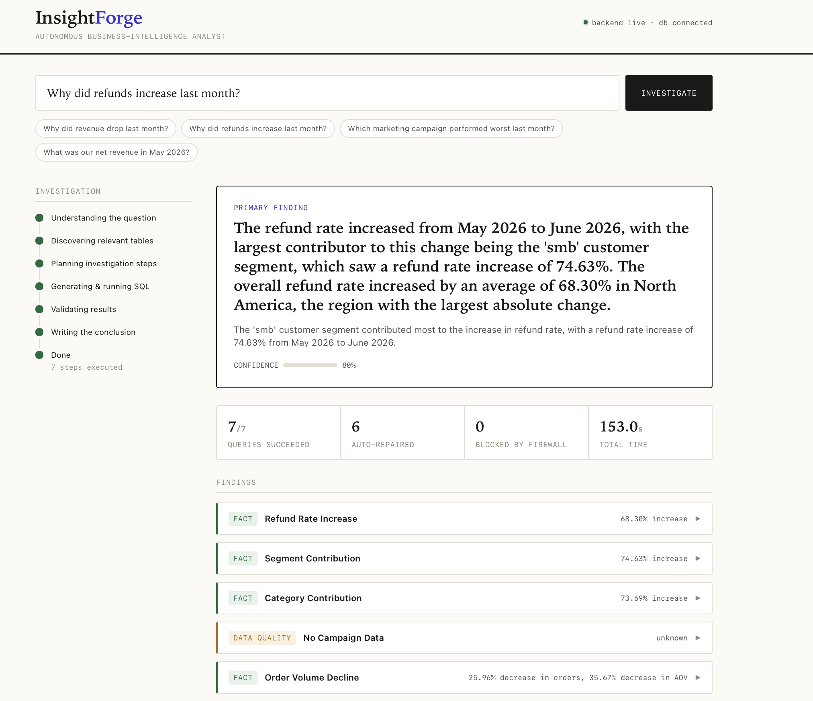
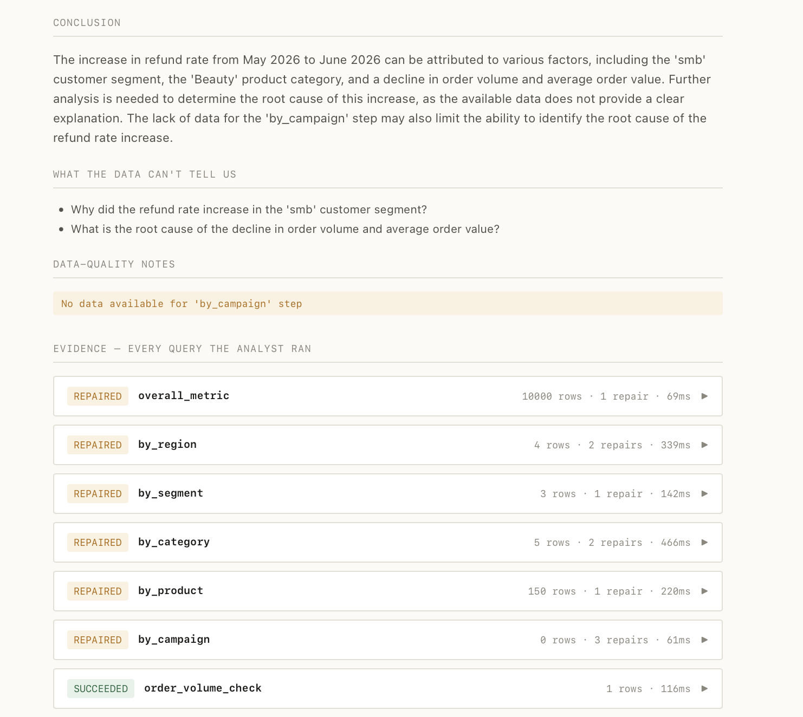

# InsightForge

InsightForge is an AI system that investigates business questions against a SQL database. You ask something like *"Why did revenue drop last month?"* and instead of returning a single query, it plans a set of analytical steps, writes SQL for each, runs the queries through a safety layer, fixes queries that fail, checks the results, and writes an explanation that separates what the data shows from what it can only suggest.

I built it because most "ask your database" tools stop at turning one question into one query. I wanted to see how much further you could take the idea — closer to how an analyst actually works through an unfamiliar dataset.



## What it does

Given a question, the system runs an eight-step pipeline:

```
Question ──► Interpreter ──► Planner ──► Schema Discovery
                                              │
     Insight Generator ◄── Validator ◄── Executor ◄── SQL Firewall ◄── SQL Generator
           │                                 ▲                            │
           ▼                                 └──── Query Repair ◄── (on error, ≤3 tries)
     Evidence-backed answer
```

1. **Interpret** — an LLM turns the question into a structured spec: which metric is being asked about (resolved against a fixed set of approved business definitions), the time period, and whether it's a root-cause question.
2. **Plan** — a rule-based planner expands that into concrete steps: compare by segment, by region, check refunds, check order volume, and so on.
3. **Discover schema** — rather than passing the whole schema to the model, each step searches for the tables relevant to it.
4. **Generate SQL** — the model writes a query for each step.
5. **Firewall** — every query is parsed with SQLGlot and only runs if it's a read-only `SELECT` against allowed tables. Writes, DDL, dangerous functions, and PII columns are rejected before the query reaches the database.
6. **Execute and repair** — queries run inside a read-only transaction. If one fails, a repair step reads the Postgres error and rewrites the query, up to three attempts.
7. **Validate** — results are checked for common mistakes that produce confident but wrong answers: empty results, join fan-out, columns that are entirely null.
8. **Explain** — a final step turns the validated results into a written answer, marking each point as an observed fact or an inference, and noting what the data can't establish.

Every figure in the answer comes from a query that actually ran. The model's job is to write SQL and phrase the result — not to supply the numbers.

Each finding can be expanded to show the SQL behind it, the rows it returned, how many repair attempts it took, and how long it ran:



## Design decisions worth noting

- **The SQL firewall parses, it doesn't pattern-match.** Regex-based filters for "dangerous SQL" are easy to bypass. This checks the actual parse tree, so a query is judged by what it does, not how it's spelled.
- **The planner is deliberately not an LLM.** Deciding which analytical steps to run is rule-based and deterministic. The model is only used where its strengths apply — reading the question and writing SQL.
- **Business terms are fixed, not inferred.** "Net revenue" resolves to one approved definition in a config file, so the model can't quietly redefine what a metric means.
- **The system is evaluated, not just demonstrated.** The synthetic database has six deliberately planted anomalies (an enterprise sales drop, a regional slowdown, a refund spike, a failed campaign, and two data-quality traps). A benchmark scores the AI's conclusions against those known causes.

## Stack

- FastAPI, async SQLAlchemy 2, PostgreSQL (via Docker)
- LLM tool-calling behind a provider abstraction (runs on Groq's free tier or Anthropic)
- SQLGlot for SQL parsing and policy checks
- pytest — 103 tests, all runnable without a database or API key
- A self-contained HTML frontend (investigation timeline + evidence panel)

## Running it

Requires Python 3.11+ and Docker.

```bash
cp .env.example .env          # add GROQ_API_KEY (free) or ANTHROPIC_API_KEY
make install                  # venv + dependencies
make db-up                    # Postgres in Docker
make seed                     # generate the synthetic database (~650k rows)
make run                      # API on :8000
```

Frontend:

```bash
cd frontend && python3 -m http.server 3000   # then open http://localhost:3000
```

Tests and evaluation:

```bash
make test    # 103 tests
make eval    # score the AI against the ground-truth benchmark
```

## Repository layout

```
backend/app/
  core/            config, database engine, logging
  api/routes/      HTTP endpoints (health, investigate, observability)
  agents/          interpreter, planner, SQL generator, query repair, insight generator
  security/        SQL firewall + audit log
  semantic_layer/  approved metric definitions (metrics.yaml)
  db/              schema discovery, read-only executor, data generator
  evaluation/      benchmark questions + scoring
  observability/   token, latency, and cost tracking
  services/        orchestrator + result validator
  schemas/         shared Pydantic models
scripts/           anomaly manifest + database seeding
docs/              architecture notes and a failure analysis
```

## Current limitations

The project runs on a free LLM tier, which sets some real boundaries:

- **Rate limits.** Groq's free tier caps daily tokens, so a full multi-question evaluation run can exhaust the budget. A paid key removes this.
- **SQL quality.** The free model sometimes writes queries with errors — referencing a column alias before it exists, nesting aggregates. The repair step recovers most of these and the firewall blocks the rest, but not every investigation finishes cleanly on the free tier.
- **Not deployed.** It runs locally. A hosted version would need managed Postgres, secrets handling, and a paid LLM key.

`docs/failure_analysis.md` covers the SQL-generation failures I observed and how the repair layer handles them. I kept that document because how the system fails is as much a part of the story as how it works.

---

Islam Mamedov — [GitHub](https://github.com/islam-mamedov) · [Hugging Face](https://huggingface.co/islam-mamedov)